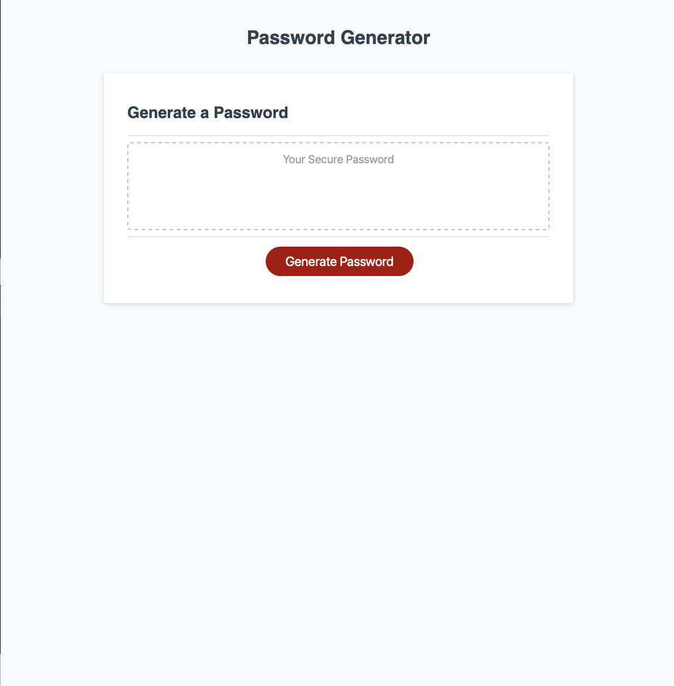

# Random password generator javascript

## Description
This password generator is a software tool that creates randomly generated passwords for users utlizing javscript. The purpose for this password generator is to create stronger passwords and provide greater security for the user by giving the user a specific criteria. 

## Installation

Clone the repository locally and double click `index.html` or click on the link below in the usage section

## Usage

Screenshot of website

To visit please click on link [link](https://github.com/Vsoto7697/victorspasswordgenerator)

## Challenges
One thing I had trouble on was setting my variables, I tried classifying each variable but I kept recieving an error message after prompts were selected. I also struggled with deploying my url and using the functionality of pushing and pulling to and from github. I believe that my biggest challenge was programming the conditional statement that links function that determined the user's password based on their input; I wasn't able to properly link each statement to the variable and kept getting a syntax error on my console. 

## License

Copyright (c) 2022 Victor Soto